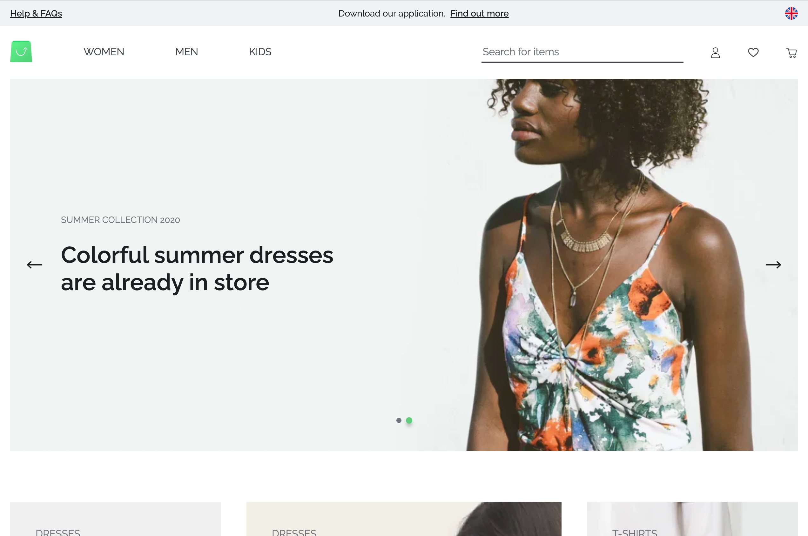

# Vue Storefront Next Example

This repo contains an example of an e-commerce store that has been built using [LexasCMS](https://www.lexascms.com/vue-storefront/) and [Vue Storefront Next](https://www.vuestorefront.io/) with the [Capybara theme](https://github.com/vuestorefront/vsf-capybara).

  

## Live Demo

[Click here](https://lexascms-example-vsf-next-capybara.herokuapp.com/) to view a live demo of this repo.

## Deploy to Heroku

If you would like to have a play around with this demo, you can deploy it to your own Heroku account by following the instructions below:

1. If you don't already have one, [create a LexasCMS account](https://app.lexascms.com/signup)
2. Create a space using the **E-commerce Starter (Vue Storefront)** template
3. From within your space, navigate to **Settings > General** and copy your space's ID
4. Click the below button and follow the instructions

